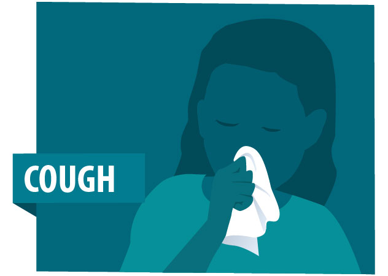

## Protecting your Mental Health During the Coronavirus Outbreak

- Fear from disease outbreaks can cause changes in sleeping and eating patterns, difficulty concentrating, and heightened anxiety.
- Focus on what you can control 
- Do what helps you feel a sense of safety 
- Spend time outside, even if you're avoiding crowds 
- Engage in mindfulness activities 
- Reach out if you need more support

#What is Coronavirus?

- a zoonotic virus from the coronavirus family that is believed to have originated from bats
- A novel coronavirus is one that has not been previously identified in humans
- Combination of rapid spreading, virulence intensity puts those that are immune compromised or deficient at high risk

#How Does Coronavirus Spread?
-Person- person contact, coughing, sneezing, fomites
-Although we have an idea on how it spreads, scientists still don't fully understand the virus and we are still learning about possible transmissions
-There has also been some speculation that this new virus can spread even if a person isn't showing any symptoms, which is unusual for a virus

## Prevention Tips
-Wash hands frequently, don't touch your face, avoid crowds, and stay home if sick

## Flattening The Curve

## Visualizing Existing Cases
<!-- -->

## Visualizing Death Caused by Coronavirus
<!-- -->
 
## Visualizing Death Caused by Coronavirus
<!-- -->

## Confirmed Cases Through Time

<!-- -->

## Cases Resulting in Death Through Time

<!-- -->

## Cases Resulting in Recovery Through Time

<!-- -->

## References

Reference: Dong E, Du H, Gardner L. An interactive web-based dashboard to track COVID-19 in real time. Lancet Infect Dis; published online Feb 19. https://doi.org/10.1016/S1473-3099(20)30120-1.  

2019 Novel Coronavirus (2019-NCoV) Situation Summary.” Centers for Disease Control and Prevention, Centers for Disease Control and Prevention, 11 Mar. 2020, www.cdc.gov/coronavirus/2019-ncov/summary.html.

## Thank You for Watching 

- Thank you to Profesor Ledford and Rebecca for an amazing quarter <3

